## Part 1. Настройка gitlab-runner

Для установки необходимо добавить репозитории и GPG ключи

`curl -L "https://packages.gitlab.com/install/repositories/runner/gitlab-runner/script.deb.sh" | sudo bash`

затем необходимо выполнить установки gitlab runner

`sudo apt install gitlab-runner`

Далее необходимо зарегистрировать раннер использую url и token из задания.

`sudo gitlab-runner register`

Далее проверяем статус 

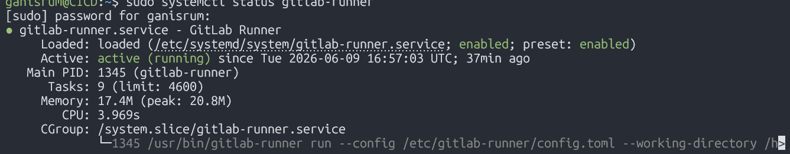 

## Part 2. Сборка

В корне директории создаем файл `.gitlab-ci.yml` и добавляем в него стадии сборки в нашем случае build

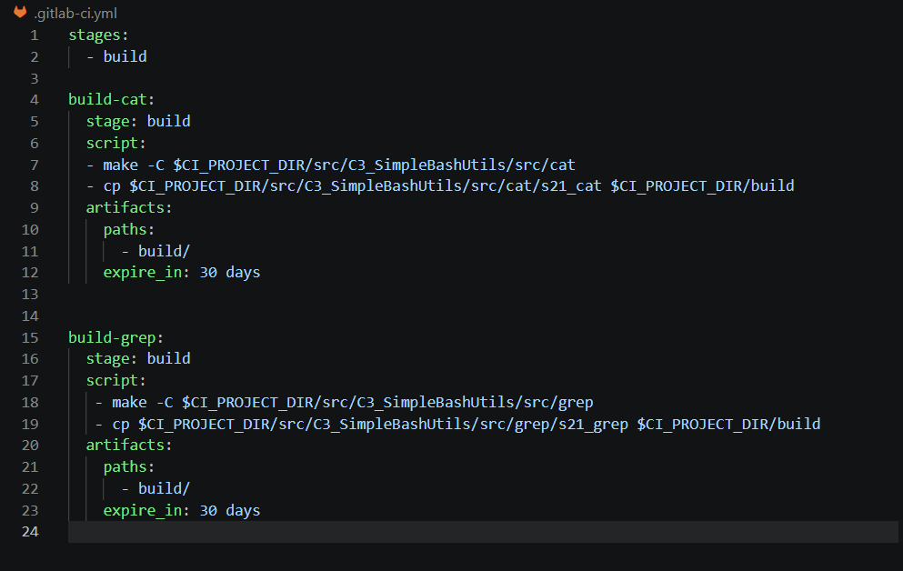 

после отправки изменений на сервер через команду `push` запускается наш pipeline

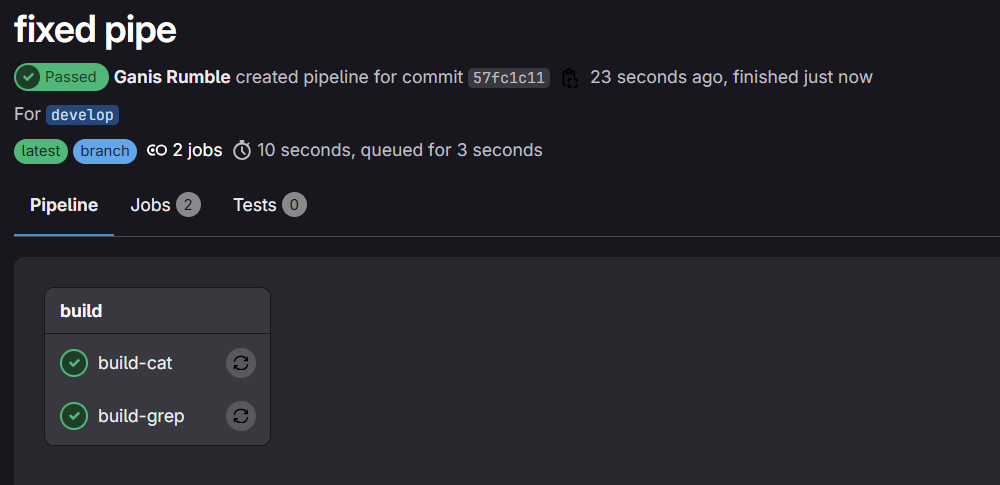 

Выбрав интересущую наc job можно увидеть детали сборки

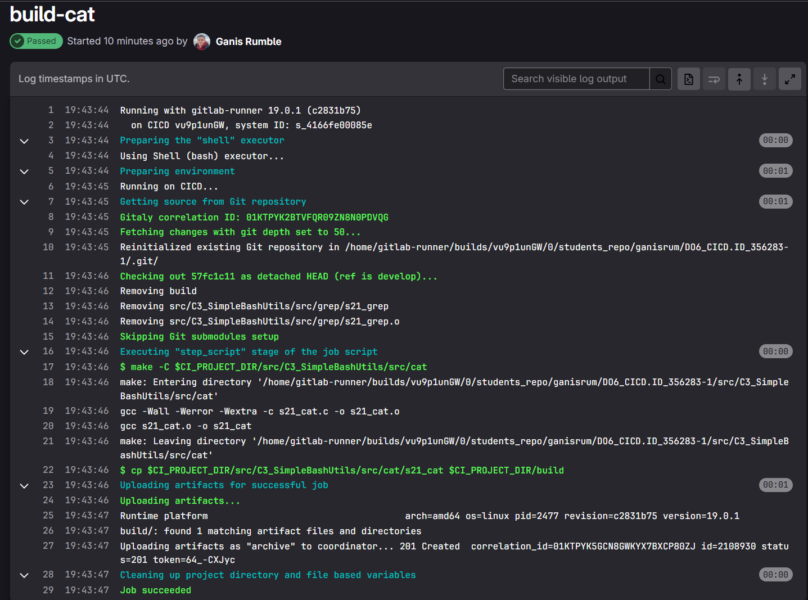

## Part 3. Тест кодстайла

Добавляем в `.gitlab-ci.yml` стадию `code-style`

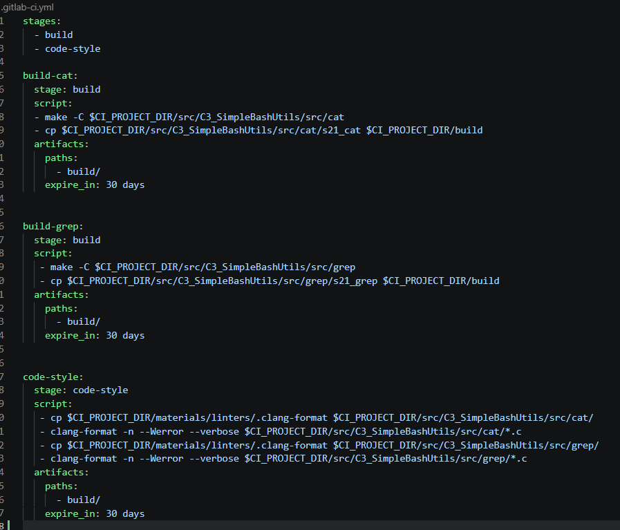

тестируем сборку успешную и с ошибками по стилю

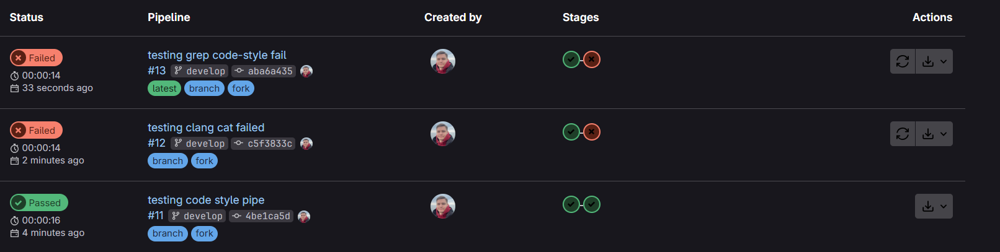

сборка с ошибками

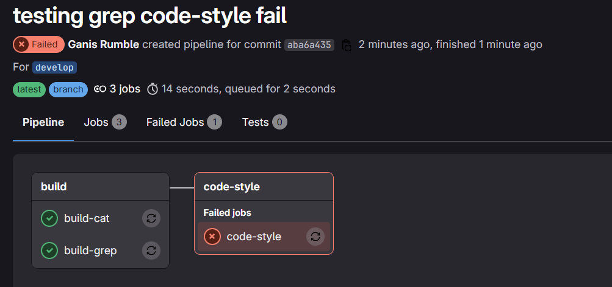

Можно увидеть в выводе какой именно файл и почему не прошел проверку.

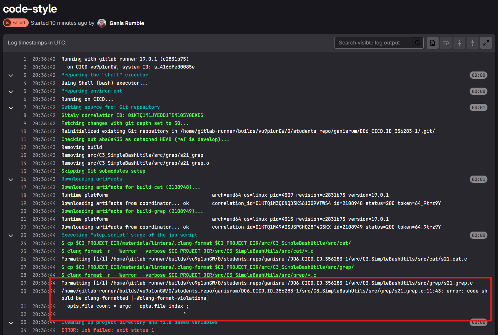

## Part 4. Интеграционные тесты

Дописываем в наш pipeline стадию тесты и 2 job для каждой из функции

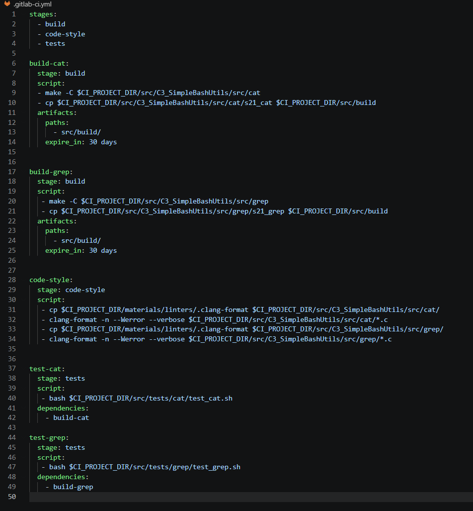

адаптируем скрыпты тестов, чтобы в случае если хоть один тест сфейлится падал pipeline

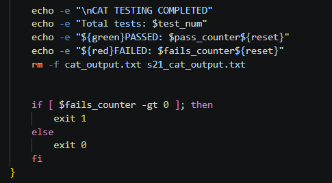

запускаем pipeline

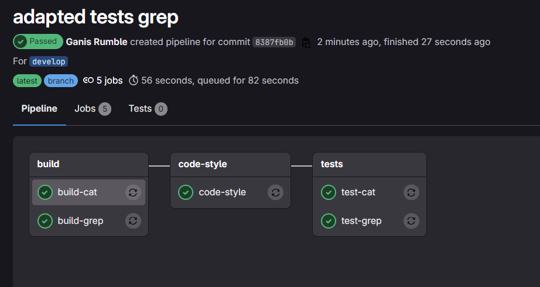

детально можем посмотреть какие тесты сфейлились 

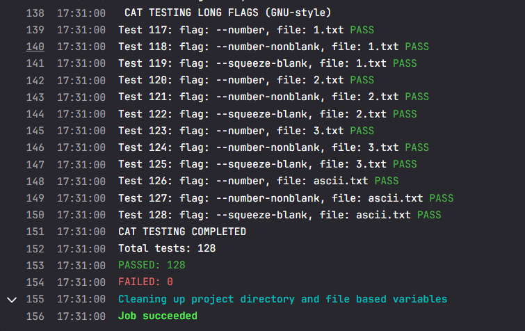

## Part 5. Этап деплоя

Создаем виртуальную машину `prodserv'
 и настраиваем на ней постоянный ip

 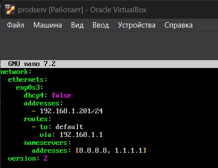

 даем права на открытие и запись в директорию `/usr/local/bin`

 переходим на CICD и переключаемся на пользователя gitlab-runner

 `sudo su - gitlab-runner`

выпускаем ssh ключ для подключения к prodserv без пароля

`ssh-keygen -t ed25519 -C "gitlab-runner-deploy-key"`

копируем ключ на наш prodserv

`ssh-copy-id ganisrum@192.168.1.201`

пишем скрипт, который будет копировать файлы на наш продсервер и в случае неудачи фейлить pipeline

 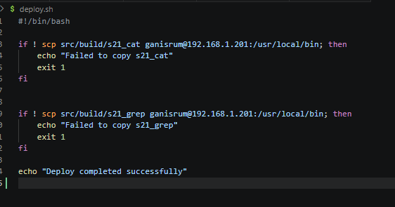

Дописываем этап deploy 

 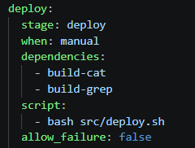

 запускаем и проверяем, деплой запускаем руками

 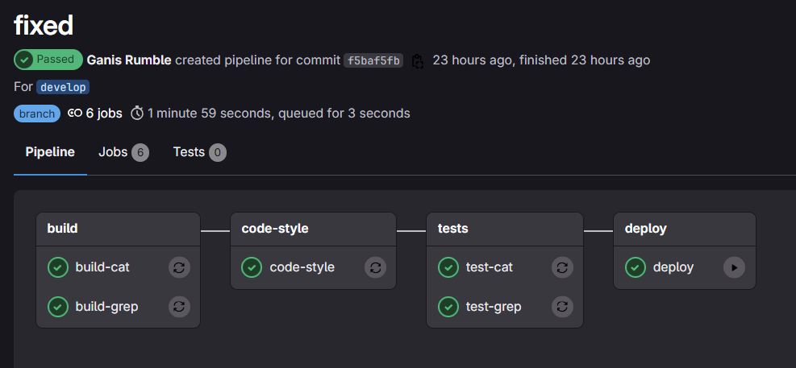

 ## Part 6. Дополнительно. Уведомления

 Создаем бота, ищем в телеграмме    `@BotFather`

 Пишем ему:

 ` /start `

 ` /newbot `

 даем имя нашему боту 

 ` ganisrum DO6 CI/CD `

 получаем токены нашего бота 

 пишем боту `@userinfobot` чтобы узнать наш id /start , и бот выдаем наш id

 на CICD машине разрешаем создавать и читать данные по пути
 
  `/etc/gitlab-runner/' там же создаем файл с нашими ключами `tg_conf.json`

  Пишем скрипт который будет отправлять нам сообщения, в него добавляем переменные с названием проекта, работы, и статус выполнения и ссылку на job

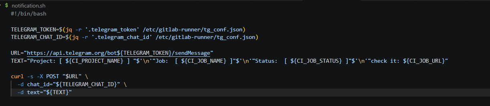

Добавляем в наш pipeline вызов скрипта после каждого этапа

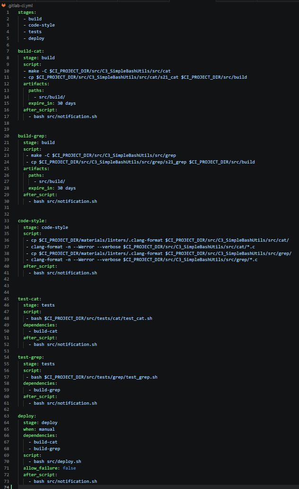

Запускаем pipeline и получаем сообщения в TG

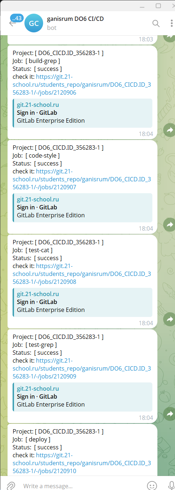
